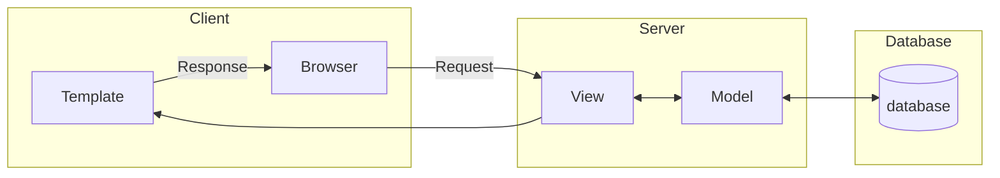

# Documento de Projeto Arquitetural

Neste documento temos o projeto arquitetural do sistema, e uma breve descrição de cada componente.

## Diagrama 

## Descrição

| Componente | Tecnologia | Descrição
|------------|------------|----------
|Template|ReactJS| Criação de componentes visuais para a tela
|Browser| - | Navegador Web
|View| Python e Django| Funções Python que se comunicam com o modelo e fornecem os dados para os templates
|Model| Python e Django| Arquivo de classes de modelo 
|Database|PostgreSQL| Banco de dados para guardar as informações salvas
